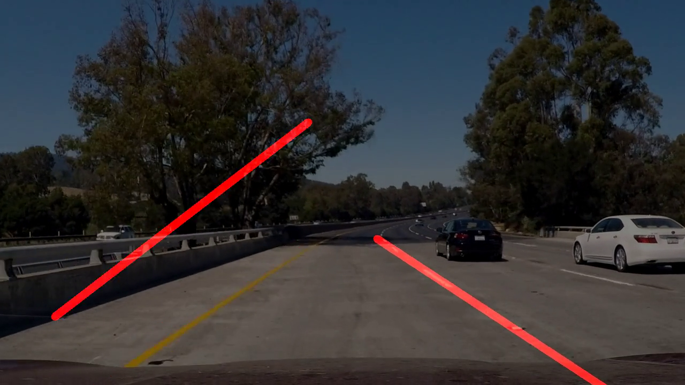

### Reflection

### 1. Describe your pipeline. As part of the description, explain how you modified the draw_lines() function.

There are 6 main steps in my lane detection pipeline:

1. turns the image into grayscale and smooths out the image using a Gaussian blue

2. uses Canny algorithm to detect edges

3. crops the image into a region that most likely have the lane lines

4. uses Hough algorithm to detect lines

5. processes randomly disconnected lines into connected left and right lane lines

6. draws found lines on top of the original image

Step 5 is done in the function average_lines() before feeding the return result to the function draw_lines(). First I filter the lines for those that are within an angle that is most likely to be of the lane lines, then I partition them into left and right lines based on the sign of the slope (positive for left and negative for right).

Then I aggregrate the two list to get the average slope and average intercept of the left and right lines. Thus, we now have the equation y = ax + b of both of left and right lines.

**NOTE: I additionally weighted in default left and right lines into the list in order to account for the case where Hough cannot find any lines**

The final step is to calculate the two endpoints of each of the left and right lines by plugging in the bottom of the image plus the top of the region that we are looking for the lane lines in. That is how I get the connected line.

### 2. Identify potential shortcomings with your current pipeline

A potential shortcoming would be when the parameters on Canny and Hough algorithm detect lines that are as steep as lane lines from other objects. An example can be seen in my challenge video:

Another potential shortcoming would be when weather or road conditions make the gradient difference in the grayscale image too hard to detect and we lose information on the lane lines.

I also assume that the lane lines fit as straight lines into the region of interest, but on a turn, the region of interest will have to be adjusted in order to capture the correct lane lines.

### 3. Suggest possible improvements to your pipeline

I can use the fact that in a small time window, the lane lines mostly stay consistent in terms of relative position in the image. With that information, we can exponentially average the lane lines found in the time window, decaying towards the past, so that we can still catch the change in the lane lines, but we also capture the trend in the lane lines. This technique should help us when Canny and Hough fail to detect lane lines or detect wrong ones.
